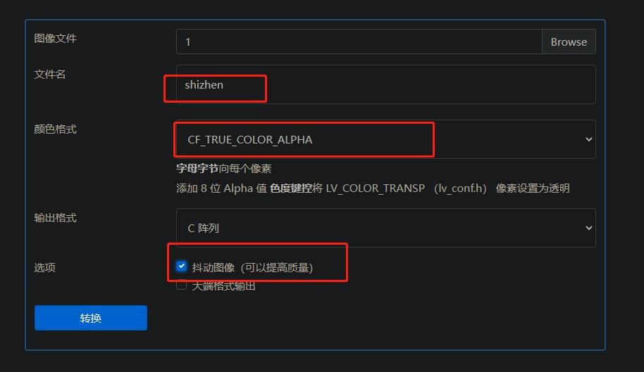

# 使用esp32点亮lcd屏幕显示时钟

## 创建时间
20220810

## 目的
1. 使用GFX Library for Arduino库点亮lcd屏幕。
2. 使用NTPClient库获取网络当前时间。
3. 使用lvgl库创建一个时钟界面并显示时间。

## 硬件
1. 开发板：esp32(devkitv1)
   
   

   
2. lcd屏幕(驱动ic：st7789, 像素240*240，spi接口)
   
   

## 软件
platformIO IDE
## 接线

|  esp32   | lcd屏幕  |
|  :----:  | :----:  |
| GND  | GND |
| 3v3  | VCC |
| D18(GPIO18)  | SCK |
| D23(GPIO23)  | SDA |
| D33(GPIO33)  | RES |
| D27(GPIO27)  | DC |
| D22(GPIO22)  | BLK |


## 编写流程

### 1. 点亮lcd屏幕
1. 在pio中添加库“GFX Library for Arduino”
   


2. 定义st7789显示屏
   ```c++
   #include <Arduino_GFX_Library.h>

   #define GFX_BL DF_GFX_BL//DF_GFX_BL为22

   //lcd屏幕没有cs引脚，故引脚5无效
   Arduino_DataBus *bus = new Arduino_ESP32SPI(27 /* DC */,5 /* CS */,18 /* SCK */,23 /* MOSI */);

   //复位引脚33 ips为真（不知道是啥） 像素240*240
   Arduino_GFX *gfx = new Arduino_ST7789(bus,33 /* RST */,0,true,240,240);

   ```

3. 在setup函数中定义display
   ```c++
   gfx->begin();
   gfx->fillScreen(RED);

   #ifdef GFX_BL
   pinMode(GFX_BL, OUTPUT);
   digitalWrite(GFX_BL, HIGH);
   #endif
   ```
4. 编译下载
   屏幕点亮为红色，表示点亮屏幕成功。

   
   
### 2. 获取网络时间
1. 在pio中添加库“NTPClient”
   
   

2. 定义时间和网络相关组件
```c++
#include <NTPClient.h>
#include "esp_wifi.h"
#include <WiFiUdp.h>
#include "WiFi.h"

//time
WiFiUDP ntpUDP;
NTPClient timeClient(ntpUDP);

const char *ssid     = "Texin-SH-Model";
const char *password = "yachuang2020";

//以秒为单位调整时区的时间,与格林尼治标准时间相差八个时区，因此8*60min = 8* 60 * 60
timeClient.setTimeOffset(8*60*60);
//连接wifi
WiFi.begin(ssid, password);
while ( WiFi.status() != WL_CONNECTED ) 
{
delay ( 500 );
Serial.print ( "." );
}
//初始化NTPClient
timeClient.begin();

//定义一个存储时间的结构体并重命名
typedef struct get_current_time GetCurrentTime;
struct get_current_time
{
int time_hour;
int time_mintues;
int time_seconds;
};
```
3. 定义一个函数获取当前时间
```c++
/**
* @brief 获取当前时间
* 
* @return GetCurrentTime 
*/
GetCurrentTime now_time()
{
GetCurrentTime t_time;
//从NTP服务器获取当前日期和时间
timeClient.update();
//得到字符串形式的时间数据
// String get_time = timeClient.getFormattedTime();
// Serial.printf("time is %s\r\n",get_time);
//获取时间数据
t_time.time_hour = timeClient.getHours();
t_time.time_mintues = timeClient.getMinutes();
t_time.time_seconds = timeClient.getSeconds();

return t_time;
}
```

4. setup函数中调用函数获取时间
```c++
//获取当前时间
GetCurrentTime clock_time = now_time();
Serial.printf("time_hour: %d\r\n", clock_time.time_hour);
Serial.printf("time_mintues: %d\r\n", clock_time.time_mintues);
Serial.printf("time_seconds: %d\r\n", clock_time.time_seconds);
```

5. 编译下载

串口显示时间正确，表示功能正确


### 3. LVGL文字显示

1. 在pio中添加库“lvgl”
   
   

2. 初始化lvgl
```c++   
#include <lvgl.h>
/**
 * @brief 初始化lvgl
 * 
 */
void lvgl_clock_init()
{
    static lv_color_t *disp_draw_buf;
    static lv_disp_draw_buf_t draw_buf;
    static lv_disp_drv_t disp_drv;

    lv_init();
    uint32_t screenWidth = gfx->width();
    uint32_t screenHeight = gfx->height();

    #ifdef ESP32
      disp_draw_buf = (lv_color_t *)heap_caps_malloc(sizeof(lv_color_t) * screenWidth * 10, MALLOC_CAP_INTERNAL | MALLOC_CAP_8BIT);
    #else
      disp_draw_buf = (lv_color_t *)malloc(sizeof(lv_color_t) * screenWidth * 10);
    #endif

    if (!disp_draw_buf)
    {
        Serial.println("LVGL disp_draw_buf allocate failed!");
    }
    else
    {
      //初始化显示缓冲区
      lv_disp_draw_buf_init(&draw_buf, disp_draw_buf, NULL, screenWidth * 10);

      /* Initialize the display */
      lv_disp_drv_init(&disp_drv);
      /* Change the following line to your display resolution */
      disp_drv.hor_res = screenWidth;
      disp_drv.ver_res = screenHeight;
      disp_drv.flush_cb = my_disp_flush;
      disp_drv.draw_buf = &draw_buf;
      lv_disp_drv_register(&disp_drv);

      /* Initialize the (dummy) input device driver */
      static lv_indev_drv_t indev_drv;
      lv_indev_drv_init(&indev_drv);
      indev_drv.type = LV_INDEV_TYPE_POINTER;
      lv_indev_drv_register(&indev_drv);

      /* Create simple label */
      lv_obj_t *label = lv_label_create(lv_scr_act());
      lv_label_set_text(label, "Hello Arduino! (V8.0.X)");
      lv_obj_align(label, LV_ALIGN_CENTER, 0, 0);
   }
}
```
3. 定义显示屏刷新函数
```c++  
/**
 * @brief Display flushing 
 * 
 * @param disp 
 * @param area 
 * @param color_p 
 */
void my_disp_flush(lv_disp_drv_t *disp, const lv_area_t *area, lv_color_t *color_p)
{
   uint32_t w = (area->x2 - area->x1 + 1);
   uint32_t h = (area->y2 - area->y1 + 1);

#if (LV_COLOR_16_SWAP != 0)
   gfx->draw16bitBeRGBBitmap(area->x1, area->y1, (uint16_t *)&color_p->full, w, h);
#else
   gfx->draw16bitRGBBitmap(area->x1, area->y1, (uint16_t *)&color_p->full, w, h);
#endif

   lv_disp_flush_ready(disp);
}  
```
4. 在loop函数中调用函数刷新屏幕
```c++
lv_timer_handler(); /* let the GUI do its work */
delay(5);
```
5. 在setup函数中调用lvgl初始化函数
```c++
lvgl_clock_init();
```
6. 编译下载
   屏幕显示“Hello Arduino! (V8.0.X)”，功能正常。

   

### 4. LVGL正常动画显示
1. 打开“\lv_conf.h”
   
   位置在“.pio\libdeps\nodemcu-32s\lvgl\lv_conf.h”，将0改为1

   

   将LV_TICK_CUSTOM改为1（否则动画不会动）

   

2. 创建cpp文件“current_clock.cpp”  

   将lv_example_meter_3.c的文件复制放入进行测试。

   ```c++
   #include <lvgl.h>
   #include "clock_main.h"
   #if LV_USE_METER && LV_BUILD_EXAMPLES

   static lv_obj_t * meter;

   static void set_value(void * indic, int32_t v)
   {
      //需要强制转换一下类型，否则会报错
      lv_meter_set_indicator_end_value(meter, (lv_meter_indicator_t *)indic, v);
   }

   /**
   * A clock from a meter
   */
   void lvgl_clock_test(void)
   {
      meter = lv_meter_create(lv_scr_act());
      lv_obj_set_size(meter, 220, 220);
      lv_obj_center(meter);

      /*Create a scale for the minutes*/
      /*61 ticks in a 360 degrees range (the last and the first line overlaps)*/
      lv_meter_scale_t * scale_min = lv_meter_add_scale(meter);
      lv_meter_set_scale_ticks(meter, scale_min, 61, 1, 10, lv_palette_main(LV_PALETTE_GREY));
      lv_meter_set_scale_range(meter, scale_min, 0, 60, 360, 270);

      /*Create another scale for the hours. It's only visual and contains only major ticks*/
      lv_meter_scale_t * scale_hour = lv_meter_add_scale(meter);
      lv_meter_set_scale_ticks(meter, scale_hour, 12, 0, 0, lv_palette_main(LV_PALETTE_GREY));               /*12 ticks*/
      lv_meter_set_scale_major_ticks(meter, scale_hour, 1, 2, 20, lv_color_black(), 10);    /*Every tick is major*/
      lv_meter_set_scale_range(meter, scale_hour, 1, 12, 330, 300);       /*[1..12] values in an almost full circle*/

      LV_IMG_DECLARE(img_hand)

      /*Add a the hands from images*/
      lv_meter_indicator_t * indic_min = lv_meter_add_needle_img(meter, scale_min, &img_hand, 5, 5);
      lv_meter_indicator_t * indic_hour = lv_meter_add_needle_img(meter, scale_min, &img_hand, 5, 5);

      /*Create an animation to set the value*/
      lv_anim_t a;
      lv_anim_init(&a);
      lv_anim_set_exec_cb(&a, set_value);
      lv_anim_set_values(&a, 0, 60);
      lv_anim_set_repeat_count(&a, LV_ANIM_REPEAT_INFINITE);
      lv_anim_set_time(&a, 2000);     /*2 sec for 1 turn of the minute hand (1 hour)*/
      lv_anim_set_var(&a, indic_min);
      lv_anim_start(&a);

      lv_anim_set_var(&a, indic_hour);
      lv_anim_set_time(&a, 24000);    /*24 sec for 1 turn of the hour hand*/
      lv_anim_set_values(&a, 0, 60);
      lv_anim_start(&a);
   }
   ```
   3. 将“img_hand.c”文件放入img文件夹下
      
      这个是指针的文件
   4. 在setup函数中调用“lvgl_clock_test”
      ```c++
      lvgl_clock_test();
      ```
   5. 下载测试
      时钟在转动，测试成功
      （这里放gif动图显示动态时钟）
      

### 5. LVGL时钟
1. 添加时针和分针图像
   打开官方图片取模网站https://lvgl.io/tools/imageconverter

   

   选择一个png或者jpeg格式的图片，本次的指针使用的是png格式

   

   选择图片文件，更改生成文件名为“shizhen”，颜色格式选择“LV_IMG_CF_TRUE_COLOR_ALPHA”，勾选抖动图像，提高质量

   

   生成的c文件放入img\shizhen.c,在被调用该图像时声明一下即可
   ```c++
   LV_IMG_DECLARE(shizhen)
   ```

   分钟图像同样操作即可

2. 初始化时钟组件参数
```c++
static lv_obj_t * meter_clock;

lv_meter_indicator_t *indic_sec;
lv_meter_indicator_t *indic_min;
lv_meter_indicator_t *indic_hour;

bool is_set_time = false;
int local_sec = 0;
int local_min = 0;
int local_hour = 0;

/**
 * @brief lvgl时钟显示
 * 
 */
void lvgl_clock(void)
{
    //创建一个圆形对象
    meter_clock = lv_meter_create(lv_scr_act());
    //设置圆形大小220*220
    lv_obj_set_size(meter_clock, 220, 220);
    //将圆形设置到中心
    lv_obj_center(meter_clock);

    //添加60个小刻度用于读取分数和秒数
    lv_meter_scale_t * scale_small = lv_meter_add_scale(meter_clock);
    lv_meter_set_scale_ticks(meter_clock, scale_small, 61, 1, 10, lv_palette_main(LV_PALETTE_RED));
    lv_meter_set_scale_range(meter_clock, scale_small, 0, 60, 360, 270);

    //添加12个大刻度用于读取小时数
    lv_meter_scale_t * scale_large = lv_meter_add_scale(meter_clock);
    lv_meter_set_scale_ticks(meter_clock, scale_large, 12, 0, 0, lv_palette_main(LV_PALETTE_RED));               /*12 ticks*/
    lv_meter_set_scale_major_ticks(meter_clock, scale_large, 1, 2, 20, lv_color_black(), 10);    /*Every tick is major*/
    lv_meter_set_scale_range(meter_clock, scale_large, 1, 12, 330, 300);       /*[1..12] values in an almost full circle*/

    //秒针 使用官方图像
    LV_IMG_DECLARE(img_hand)
    //分针 自定义图像
    LV_IMG_DECLARE(fenzhen)
    //时针 自定义图像
    LV_IMG_DECLARE(shizhen)

    /*Add a the hands from images*/
    indic_sec = lv_meter_add_needle_img(meter_clock, scale_small, &img_hand, 5, 5);
    indic_min = lv_meter_add_needle_img(meter_clock, scale_small, &fenzhen, 5, 5);
    indic_hour = lv_meter_add_needle_img(meter_clock, scale_small, &shizhen, 5, 5);

    /*Create an animation to set the value*/
    lv_anim_t a;
    lv_anim_init(&a);
    lv_anim_set_exec_cb(&a, set_value_sec);
    lv_anim_set_values(&a, 0, 60);
    lv_anim_set_repeat_count(&a, LV_ANIM_REPEAT_INFINITE);
    lv_anim_set_time(&a, 1000 * 60);    
    lv_anim_set_var(&a, indic_sec);
    lv_anim_start(&a);
}

/**
 * @brief lvgl clock回调函数
 * 
 * @param indic 
 * @param v 
 */
static void set_value_sec(void * indic, int32_t v)
{
    if(is_set_time == false)
    {
        GetCurrentTime clock_time = now_time();
        
        local_sec = clock_time.time_seconds;
        local_min = clock_time.time_mintues;
        if(clock_time.time_hour >=12)
        {
            local_hour = clock_time.time_hour - 12;
        }
        local_hour = local_hour*5 + local_min/12;//为了精确显示，时针也指向60个刻度
        lv_meter_set_indicator_end_value(meter_clock, indic_sec, local_sec);
        lv_meter_set_indicator_end_value(meter_clock, indic_min, local_min);
        lv_meter_set_indicator_end_value(meter_clock, indic_hour, local_hour);
        
        is_set_time = true;
    }


    if((lv_meter_indicator_t *)indic == indic_sec)
    {
        
        if(local_sec < 59)
        {
            local_sec++;
            lv_meter_set_indicator_end_value(meter_clock, indic_sec, local_sec);
        }
        else if(local_sec == 59)
        {
            local_sec = 0;
            lv_meter_set_indicator_end_value(meter_clock, indic_sec, local_sec);

            if(local_min < 59)
            {
                local_min++;
                lv_meter_set_indicator_end_value(meter_clock, indic_min, local_min);
            }
            else if(local_min == 59)
            {
                local_min = 0;
                lv_meter_set_indicator_end_value(meter_clock, indic_min, local_min);

                if(local_hour < 59)
                {
                    local_hour++;
                    lv_meter_set_indicator_end_value(meter_clock, indic_hour, local_hour);
                }
                else if(local_hour == 59)
                {
                    local_hour = 0;
                    lv_meter_set_indicator_end_value(meter_clock, indic_hour, local_hour);
                }

                
            }
        }    
    }    
}
```

3. 在setup函数中调用
```c++
lvgl_clock();
```

4. 编译下载
   
   和当前时间一样，测试成功
   （这里放第二个动图）
